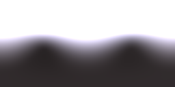

## Purpose
In [LearnOpenGL PBR](https://learnopengl.com/PBR/IBL/Diffuse-irradiance), there is an implementation of generating irradiance map based on an environment map. That solution is only available for OpenGL framework, but I cannot export the result and use it elsewhere. When I implement my own ray-tracer (base on Nori), I would like to implement IBL. When calculating lighting on diffuse material, an irradiance map would be handy to get faster convergence. Alternative solutions, Monte Carlo sampling would need more samples(MIS may help); Spherical Harmonic(More advanced but need some work to implement). Why not do Riemann Integral (Convolute) to the texture.

## Usage
modify the input image path in source code :D, then build and run.

## Dependency
* OpenExr
* OpenMP(optional?)

## TODO
```stb_image``` supports HDR format.

## Result
[output irradiance map (EXR)](image/diffuse_uffizi.exr)  
  
[original](https://vgl.ict.usc.edu/Data/HighResProbes/) and [its diffusion version](https://vgl.ict.usc.edu/Data/HighResProbes/diffuse/uffizi-large_diffuse.rar)
